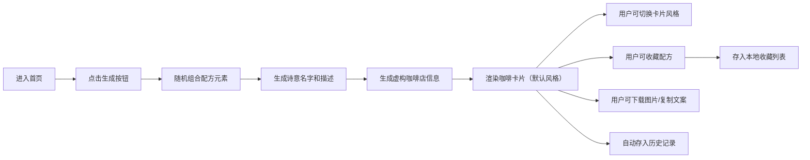

## 1. 产品概述

虚构咖啡配方生成器是一款创意灵感工具，通过随机组合咖啡基底、风味元素、奶类和装饰，生成独特的特调咖啡配方，并配以诗意命名、风味描述和虚构咖啡店场景。

- **主要用途**：为咖啡爱好者、创意人士提供灵感，生成不存在的创意咖啡配方
- **目标用户**：咖啡爱好者、创意工作者、社交媒体内容创作者
- **产品价值**：提供趣味性、创意性的内容生成体验，支持社交分享

## 2. 核心功能

### 2.1 功能模块

1. **首页/生成器页面**：咖啡配方生成核心界面，卡片展示区，风格切换，操作按钮
2. **收藏页面**：展示用户收藏的咖啡配方卡片列表
3. **历史记录页面**：展示用户生成过的所有咖啡配方

### 2.2 页面详情

| 页面名称 | 模块名称 | 功能描述 |
|---------|---------|---------|
| 生成器页面 | 配方生成引擎 | 随机组合基底、风味、奶类、装饰，生成诗意名字和风味描述 |
| 生成器页面 | 咖啡卡片展示 | 以精美卡片形式展示完整配方信息，支持4种风格切换 |
| 生成器页面 | 风格切换器 | 复古菜单、极简白卡、深夜咖啡馆、春日野餐四种视觉风格 |
| 生成器页面 | 操作按钮区 | 生成新配方、收藏、下载图片、复制文案、查看历史/收藏 |
| 收藏页面 | 收藏列表 | 网格布局展示所有收藏的配方卡片，支持取消收藏 |
| 历史记录页面 | 历史列表 | 时间线展示所有生成过的配方，支持快速收藏 |
| 全局 | 咖啡店信息 | 每次生成虚构店名、城市和氛围描写 |

## 3. 核心流程

**用户主流程描述**：
1. 用户进入应用，看到默认的引导卡片
2. 点击「生成一杯特调」按钮，系统随机生成完整咖啡配方
3. 配方以精美卡片形式呈现，用户可切换不同视觉风格
4. 用户可收藏喜欢的配方，或下载卡片图片、复制文案分享
5. 所有生成过的配方自动存入历史记录，可随时回顾

## 4. 用户界面设计

### 4.1 设计风格

**整体美学方向**：温暖治愈的文艺质感，带有咖啡文化的浪漫气息

- **主色调**：深咖啡色 (#3E2723)、奶咖色 (#D7CCC8)、温暖米白 (#FAFAFA)
- **辅助色**：根据卡片风格动态变化（复古红、深夜蓝、春日绿等）
- **字体选择**：
  - 标题字体：优雅衬线字体（如 Noto Serif SC 或定制书法字体）
  - 正文字体：现代无衬线字体（如 Noto Sans SC）
- **按钮风格**：圆润胶囊形状，带微妙阴影和悬停动效
- **布局风格**：以卡片为中心的沉浸式布局，周围留白营造呼吸感
- **图标风格**：线性简约图标，统一 24px 尺寸，使用 lucide-react

### 4.2 四种卡片风格设计

| 风格名称 | 色彩方案 | 字体特点 | 装饰元素 |
|---------|---------|---------|---------|
| **复古菜单** | 做旧米黄底 + 深棕字 + 暗红点缀 | 复古打字机字体 + 手写体 | 虚线边框、邮戳印章、咖啡渍纹理 |
| **极简白卡** | 纯白底 + 炭灰字 + 细金线条 | 极简无衬线 + 大量留白 | 细线分割、微浮雕质感、无多余装饰 |
| **深夜咖啡馆** | 深蓝黑底 + 暖黄霓虹字 + 暗红 | 霓虹灯效果字体 + 手写签名字体 | 霓虹光晕、雨夜窗影、颗粒噪点 |
| **春日野餐** | 淡奶油底 + 草木绿 + 樱粉点缀 | 圆润可爱字体 + 手写体 | 小碎花边框、格子纹理、手绘装饰 |

### 4.3 页面设计概览

| 页面名称 | 模块名称 | UI 元素 |
|---------|---------|---------|
| 生成器页面 | 顶部导航 | Logo + 历史按钮 + 收藏按钮 + 风格切换器 |
| 生成器页面 | 中心卡片区 | 3D 透视卡片，带微妙阴影和悬浮动效 |
| 生成器页面 | 底部操作区 | 生成按钮（主按钮）+ 功能按钮组（收藏、下载、复制） |
| 生成器页面 | 咖啡店信息 | 卡片底部区域，小字呈现店名、城市、氛围 |
| 收藏/历史页面 | 列表区 | 响应式网格布局，卡片缩略图，悬停放大 |
| 收藏/历史页面 | 空状态 | 可爱咖啡插画 + 引导文字 |

### 4.4 响应式设计

- **桌面端（>1024px）**：卡片居中展示，最大宽度 480px，两侧留白
- **平板端（768-1024px）**：卡片宽度自适应，占屏幕宽度 80%
- **移动端（<768px）**：卡片占满屏幕宽度（左右 16px 边距），按钮区域优化为底部固定栏
- **触摸优化**：所有可点击元素最小 44x44px，按钮间距 8px 以上
