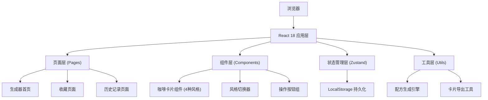

## 1. 架构设计



## 2. 技术栈描述

- **前端框架**：React 18 + TypeScript 5
- **构建工具**：Vite 5
- **样式方案**：TailwindCSS 3.4 + CSS 变量
- **状态管理**：Zustand 4.5
- **路由管理**：React Router DOM 6
- **图标库**：Lucide React
- **图片导出**：html2canvas（用于卡片转图片下载）
- **数据持久化**：LocalStorage（收藏和历史记录）

## 3. 目录结构

```
src/
├── components/
│   ├── CoffeeCard/          # 咖啡卡片组件（含4种风格）
│   │   ├── CoffeeCard.tsx
│   │   ├── styles/
│   │   │   ├── VintageMenu.tsx
│   │   │   ├── Minimalist.tsx
│   │   │   ├── MidnightCafe.tsx
│   │   │   └── SpringPicnic.tsx
│   ├── StyleSwitcher.tsx    # 风格切换器
│   ├── ActionButtons.tsx    # 操作按钮组
│   ├── Header.tsx           # 顶部导航
│   └── RecipeGrid.tsx       # 收藏/历史列表网格
├── pages/
│   ├── GeneratorPage.tsx    # 生成器首页
│   ├── FavoritesPage.tsx    # 收藏页面
│   └── HistoryPage.tsx      # 历史记录页面
├── hooks/
│   └── useCoffeeGenerator.ts # 咖啡生成逻辑 Hook
├── store/
│   └── useCoffeeStore.ts    # Zustand 状态管理
├── utils/
│   ├── recipeGenerator.ts   # 配方生成引擎
│   ├── nameGenerator.ts     # 诗意名字生成器
│   ├── descriptionGenerator.ts # 风味描述生成器
│   ├── shopGenerator.ts     # 咖啡店信息生成器
│   ├── exportCard.ts        # 卡片导出工具
│   └── copyText.ts          # 复制文案工具
├── data/
│   ├── ingredients.ts       # 原料数据（基底、风味、奶类、装饰）
│   └── templates.ts         # 名字/描述模板数据
├── types/
│   └── index.ts             # TypeScript 类型定义
├── App.tsx
├── main.tsx
└── index.css
```

## 4. 路由定义

| 路由 | 页面 | 用途 |
|------|------|------|
| `/` | GeneratorPage | 咖啡配方生成器首页 |
| `/favorites` | FavoritesPage | 收藏的咖啡配方列表 |
| `/history` | HistoryPage | 生成历史记录列表 |

## 5. 数据模型

### 5.1 核心类型定义

```typescript
// 咖啡配方
interface CoffeeRecipe {
  id: string;
  name: string;           // 诗意名字
  base: string;           // 基底
  flavors: string[];      // 风味元素（2-3种）
  milk: string;           // 奶类
  topping: string;        // 装饰
  description: string;    // 风味描述
  createdAt: number;      // 生成时间戳
  isFavorite: boolean;    // 是否已收藏
  style: CardStyle;       // 当前选择的风格
}

// 咖啡店信息
interface CoffeeShop {
  name: string;           // 店名
  city: string;           // 城市
  atmosphere: string;     // 氛围描写
}

// 卡片风格
type CardStyle = 'vintage' | 'minimalist' | 'midnight' | 'spring';

// 完整卡片数据
interface CoffeeCardData {
  recipe: CoffeeRecipe;
  shop: CoffeeShop;
  style: CardStyle;
}
```

### 5.2 Zustand Store 状态

```typescript
interface CoffeeState {
  // 当前展示的卡片
  currentCard: CoffeeCardData | null;
  // 收藏列表
  favorites: CoffeeRecipe[];
  // 历史记录
  history: CoffeeRecipe[];
  // 当前选择的风格
  currentStyle: CardStyle;
  
  // Actions
  generateNewRecipe: () => void;
  toggleFavorite: (recipeId: string) => void;
  setCurrentStyle: (style: CardStyle) => void;
  clearHistory: () => void;
  removeFavorite: (recipeId: string) => void;
}
```

### 5.3 原料数据结构

```typescript
interface IngredientsData {
  bases: string[];        // 咖啡基底（浓缩、冷萃、手冲等）
  flavors: string[];      // 风味元素（香草、焦糖、榛果等）
  milks: string[];        // 奶类（全脂、燕麦、椰奶等）
  toppings: string[];     // 装饰（奶泡、肉桂、焦糖淋酱等）
}
```

## 6. 核心算法说明

### 6.1 配方生成算法
1. 从 bases 数组随机选择 1 种基底
2. 从 flavors 数组随机选择 2-3 种风味元素（不重复）
3. 从 milks 数组随机选择 1 种奶类
4. 从 toppings 数组随机选择 1 种装饰

### 6.2 诗意名字生成算法
- 使用模板组合：[形容词] + [名词] + [咖啡相关词]
- 或使用：[季节/时间] + [意象] + [特调]
- 例如：「春日樱落拿铁」、「午夜星河冷萃」

### 6.3 风味描述生成算法
- 基于选择的原料组合，从模板库中匹配描述片段
- 组合成 80-120 字的流畅段落
- 包含口感、香气、余韵三个层次的描写

### 6.4 卡片导出实现
- 使用 html2canvas 将 DOM 节点渲染为 Canvas
- 转换为 PNG 格式并触发下载
- 支持 2x 分辨率导出，确保图片清晰度

## 7. 关键技术点

1. **卡片风格切换**：使用 CSS 变量 + 动态 class 实现四种风格的无缝切换
2. **本地持久化**：zustand 中间件 persist 自动同步到 localStorage
3. **图片导出**：html2canvas 配置 useCORS 处理跨域图片，scale: 2 保证清晰度
4. **动画效果**：CSS transition + transform 实现卡片翻转、悬浮等动效
5. **响应式布局**：Tailwind 响应式断点 + 容器查询实现多端适配
